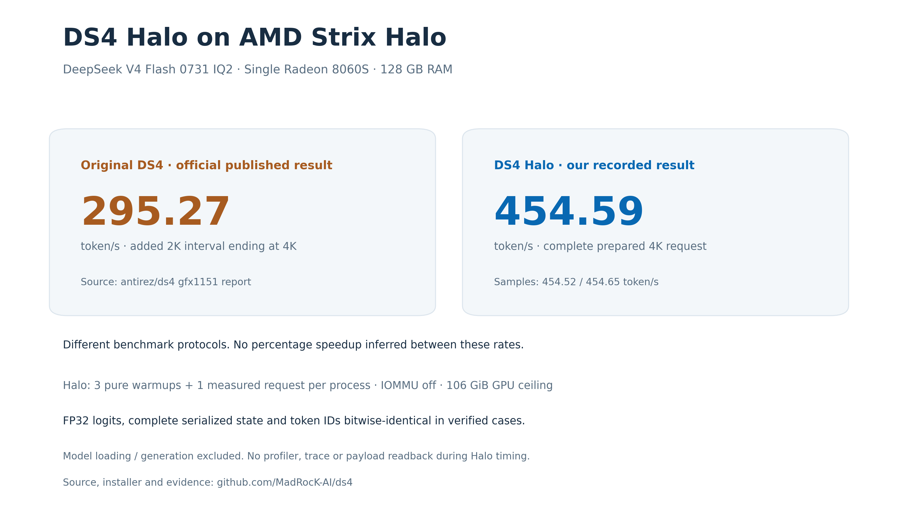

# Halo performance and quality

## Prefill

| Strix Halo, DeepSeek V4 Flash 0731 IQ2, 128 GB | Prefill |
| --- | ---: |
| Original DS4 — official published 2K→4K interval | **295.27 token/s** |
| DS4 Halo — prepared complete 4K request | **454.59 token/s** |

The DS4 reference is the integrated default gfx1151 path in the [official report](https://github.com/antirez/ds4/blob/0aaea5a238fb41a35106a551e73c8409dfb751ac/speed-bench/gfx1151-prefill-results.md), not an unmerged PR or our own baseline measurement. It reports 231.91 at the initial 2K request, 292.86 in the earlier warm 4K table, and 295.27 for the later pure-prefill 2K interval ending at 4K. We use the latter as the single published reference.

**Protocols differ.** DS4's published result is an added 2K interval with its recorded SDK/preparation; Halo measures a complete prepared 4K request. No percentage speedup is calculated between these published numbers.

Halo's October 6 samples were **454.52 / 454.65**, mean **454.59 token/s**. Each independent process used three pure-prefill warmups and one measured complete position-zero request, capacity 4,352, no generation. Conditions: Ryzen AI Max+395/Radeon 8060S, IOMMU off, 106 GiB shared GPU ceiling. Loading is excluded; timing has no profiler, trace or payload dumps. [Full observations](halo/halo2-qualification.json) · [Installed acceptance and scope](HALO_RELEASE.md).



## Reproduce the prepared 4K workload

Build the pinned source with the [recorded SDK](HALO_RELEASE.md#build-dependencies) and supply the supported model. The prompt is the unchanged public-domain `speed-bench/promessi_sposi.txt` (SHA256 `f53e0d80cb2d4492d24ebd63c7000c397b16ae70f9bf09b3763e5d8323ec209f`). Use a shell without inherited `DS4_*` tuning or `LD_PRELOAD`. On a single-Halo system, device 0 is the iGPU; on a mixed-GPU system select the physical Halo with `ROCR_VISIBLE_DEVICES` first.

```sh
MODEL=/absolute/path/to/the/supported-0731.gguf
BENCH_OUTPUT=$(mktemp -d ../halo-4k-XXXXXX)
for sample in 1 2; do
  HIP_VISIBLE_DEVICES=0 DS4_ROCM_HALO_PREFILL=1 DS4_METAL_PREFILL_CHUNK=4096 \
  DS4_BENCH_TIMING_CSV="$BENCH_OUTPUT/timing-$sample.csv" \
  ./ds4-bench --rocm --gpu-devices 0 --gpu-vram 100 --power 100 \
    -m "$MODEL" --prompt-file speed-bench/promessi_sposi.txt \
    --ctx-start 4096 --ctx-max 4096 --ctx-alloc 4352 --step-incr 2048 \
    --prefill-chunk 4096 --gen-tokens 0 --prefill-warmup 3 \
    --csv "$BENCH_OUTPUT/summary-$sample.csv"
done
```

Each process prints its first-use/warmup costs separately before the measured request. Average the two measured prefill rates. The recorded 454.59 result used IOMMU off, the 106 GiB shared GPU ceiling and the SDK/model identities above. The installer and this command do not configure the host. The ordinary server defaults are a separate 2K-chunk/32K-context configuration.

## Context lengths


The context overview starts at **2K**. Its incremental curve, current prepared 4K result and historical complete long prompts occupy separate panels; no line joins protocols or campaigns. These are Halo results. The official DS4 report has no Strix Halo 32K/64K/128K complete-prompt rates; no locally measured baseline curve is substituted for it.

| Complete first-use prompt | Halo, 2K chunks + indexer | Halo, earlier 4K chunks |
| --- | ---: | ---: |
| 32K | **391.33** | **400.58** |
| 64K | **361.87** | **354.53** |
| 128K | **319.29** | **288.48** |

Rates are token/s, recorded September 25–26. Required first-use preparation is included; loading is excluded. The 400.58 result is the earlier 4K configuration, not the 2K indexer result. These historical measurements have not been repeated for rc.2. Historical prepared records of 447.51 and 449.03 remain separately bound to their original source and protocol.

[Complete recorded data](halo/figures/prefill-context-data.json) · [Plotting method and source audit](halo/figures/README.md) · [SVG](halo/figures/prefill-context-overview.svg) · [PDF](halo/figures/prefill-context-overview.pdf).

## Quality

Fresh original-DS4 token IDs, complete FP32 logits and serialized states match Halo bitwise in the tested 4K cases, including after 16 generated tokens. The cache-lifetime sequence also passed. The cleaned rc.2 installer-built executable matched all six complete numerical payloads and passed bounded API execution. Weights and quantization are preserved. Historical 32K/64K/128K, 223 incremental payload and 31 restoration checks remain separate; that wider matrix was not rerun on rc.2. [Numerical evidence](HALO_EVIDENCE.md).

Halo adds optimized routed MoE, attention, projection and resident-key indexer paths. Enable with `DS4_ROCM_HALO_PREFILL=1`; unsupported shapes retain native dispatch. [Implementation](HALO.md) · [Release validation](HALO_RELEASE.md).
