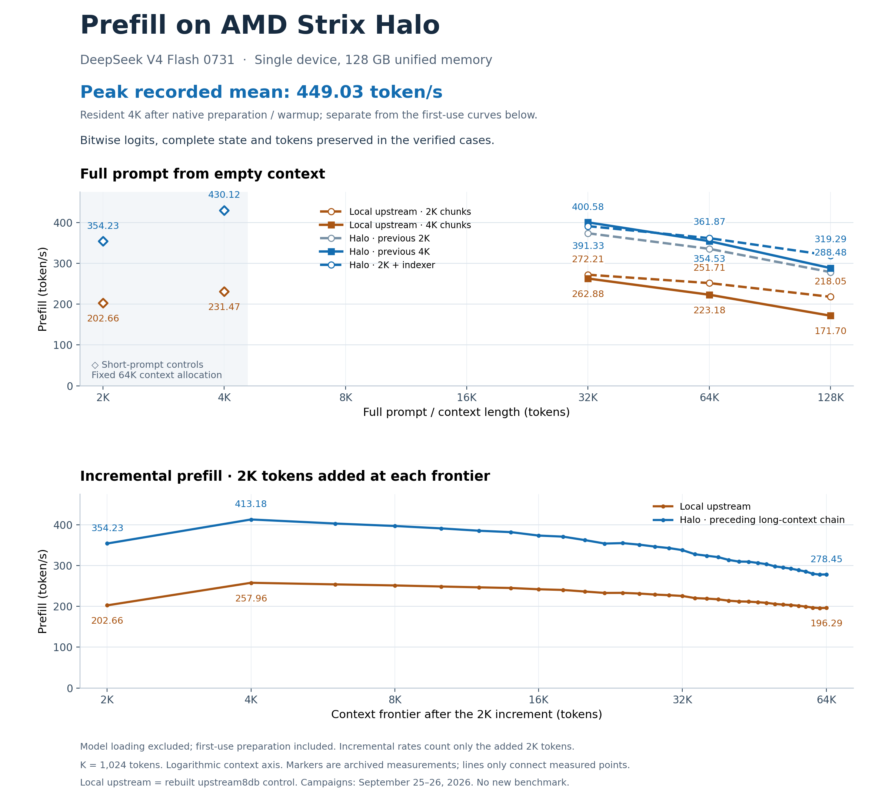

# Halo performance and quality

## Performance

**Up to 449.03 token/s prefill, with bitwise-preserved logits and state in verified cases.** DeepSeek V4 Flash 0731 on AMD Strix Halo (`gfx1151`), 128 GB unified memory.

| Result | Prefill |
|---|---:|
| Halo best recorded mean, resident 4K | **449.03 token/s** |
| Halo controlled resident 4K test | **447.51 token/s** |
| Official DS4 published 4K interval | 295.27 token/s |

**Measured improvement: +43.78%** in the controlled resident 4K comparison against upstream DS4 rebuilt on the same machine. The official published value uses 2K increments; it is context, not the denominator of that controlled gain. [Official DS4 source](https://github.com/antirez/ds4/blob/0aaea5a238fb41a35106a551e73c8409dfb751ac/speed-bench/gfx1151-prefill-results.md) - [Measurement records](halo/peak-performance.json).

## Prefill across context lengths

The upper panel shows complete empty-context prompts; the lower panel measures each **2K increment**, from 2K to 64K. Short-prompt diamonds use a fixed 64K context allocation and are not joined to the long-prompt curves. Fresh 8K/16K points are unavailable in this dataset. **Local upstream** means the rebuilt upstream8db control on Halo.

| Full prompt | Local upstream, best chunk (2K) | Halo, previous 4K | Halo, 2K + indexer | Indexer gain over its contemporary 2K control |
|---|---:|---:|---:|---:|
| 32K | 272.21 | 400.58 | 391.33 | +4.57% |
| 64K | 251.71 | 354.53 | 361.87 | +7.84% |
| 128K | 218.05 | 288.48 | 319.29 | +14.46% |

Rates are token/s. The indexer gain uses its own matched A/B measurements; the preceding curves are from the earlier campaign. All necessary first-use preparation is included, model loading is excluded. The new indexer was measured with 2K chunks; the 4K curve retains its preceding results.

[CSV measurements](halo/figures/prefill-context-data.csv) · [Sources and plotting method](halo/figures/README.md) · [SVG](halo/figures/prefill-context-indexer-update.svg) · [PDF](halo/figures/prefill-context-indexer-update.pdf) · [Previous four-variant chart](halo/figures/prefill-context-four-variants.png).

## Quality

**Full FP32 logits, complete serialized state and token IDs are bitwise identical to the reference in the verified cases.** Model weights and quantization are preserved. Coverage includes fresh32K/64K/128K prompts, 223 incremental payload comparisons and 31 snapshot restorations. [Verification evidence](HALO_EVIDENCE.md).

## What changes

Halo adds optimized ROCm prefill paths for routed MoE, attention, projections and the resident-key indexer. Enable them with `DS4_ROCM_HALO_PREFILL=1`; unsupported shapes retain native dispatch. [Implementation and supported configurations](HALO.md).

Figures are the accepted historical measurements; the integrated release's ROCm build/link passed in WSL. [Release record](HALO_RELEASE.md). Exact measurements and benchmark conditions remain in the linked evidence files.
