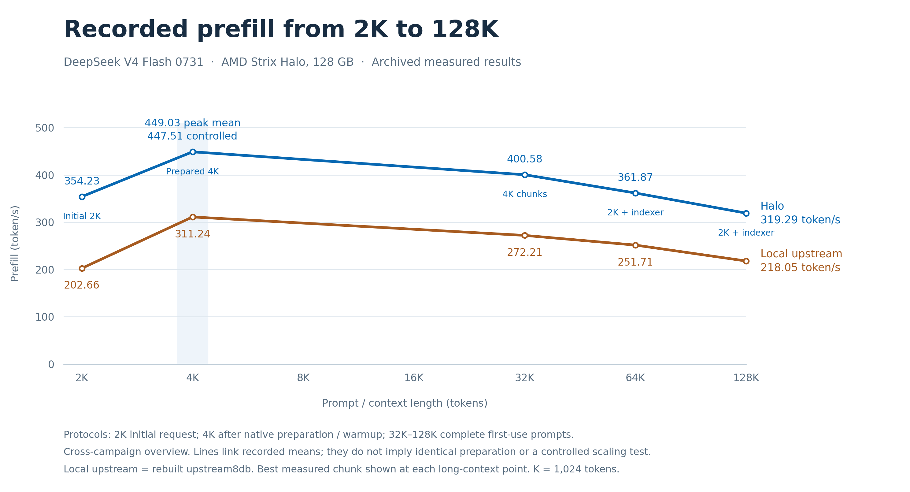

# Halo performance and quality

## Performance

**Up to 449.03 token/s prefill, with bitwise-preserved logits and state in verified cases.** DeepSeek V4 Flash 0731 on AMD Strix Halo (`gfx1151`), 128 GB unified memory.

| Result | Prefill |
|---|---:|
| Halo best recorded mean, resident 4K | **449.03 token/s** |
| Halo controlled resident 4K test | **447.51 token/s** |
| Official DS4 published 4K interval | 295.27 token/s |

**Measured improvement: +43.78%** in the controlled resident 4K comparison against upstream DS4 rebuilt on the same machine. The official published value uses 2K increments; it is context, not the denominator of that controlled gain. [Official DS4 source](https://github.com/antirez/ds4/blob/0aaea5a238fb41a35106a551e73c8409dfb751ac/speed-bench/gfx1151-prefill-results.md) - [Measurement records](halo/peak-performance.json).

## Prefill across context lengths

**Recorded prefill from 2K to 128K, including both 4K results above: 449.03 best mean and 447.51 controlled.** The 2K point is an initial request; 4K follows native preparation/warmup; long prompts include first-use preparation. Each point identifies its setting. The connecting lines summarize recorded means across those protocols; they are not a controlled context-scaling experiment. Local upstream is the rebuilt upstream8db control on Halo.

| Context | Local upstream | Halo, 2K + indexer | Halo shown in chart | Measurement / setting |
|---|---:|---:|---:|---|
| 2K | 202.66 | — | **354.23** | Initial 2K request |
| 4K | 311.24 | — | **449.03** | Prepared 4K; controlled result **447.51** |
| 32K | 272.21 | 391.33 | **400.58** | 4K chunks |
| 64K | 251.71 | 361.87 | **361.87** | 2K + indexer |
| 128K | 218.05 | 319.29 | **319.29** | 2K + indexer |

Rates are token/s; model loading is excluded. The 4K measurement follows native preparation/warmup and has no prefix reuse; initial 2K and long complete prompts include first-use preparation. **400.58 at 32K belongs to 4K chunks; the fixed 2K + indexer result is 391.33.** The long-context points select the best recorded chunk at each prompt length.

[Fixed 2K + indexer chart](halo/figures/prefill-context-indexer-update.png) · [Overview source times and protocol bindings](halo/figures/prefill-context-overview.json) · [CSV measurements](halo/figures/prefill-context-data.csv) · [Sources and plotting method](halo/figures/README.md) · [SVG](halo/figures/prefill-context-overview.svg) · [PDF](halo/figures/prefill-context-overview.pdf).

The [archived incremental chart from 2K to 64K](halo/figures/prefill-context-incremental.png) measures each added 2K interval in the **preceding campaign, before the indexer upgrade**; it is not the updated full-prompt curve.

## Quality

**Full FP32 logits, complete serialized state and token IDs are bitwise identical to the reference in the verified cases.** Model weights and quantization are preserved. Coverage includes fresh32K/64K/128K prompts, 223 incremental payload comparisons and 31 snapshot restorations. [Verification evidence](HALO_EVIDENCE.md).

## What changes

Halo adds optimized ROCm prefill paths for routed MoE, attention, projections and the resident-key indexer. Enable them with `DS4_ROCM_HALO_PREFILL=1`; unsupported shapes retain native dispatch. [Implementation and supported configurations](HALO.md).

Figures are the accepted historical measurements; the integrated release's ROCm build/link passed in WSL. [Release record](HALO_RELEASE.md). Exact measurements and benchmark conditions remain in the linked evidence files.
